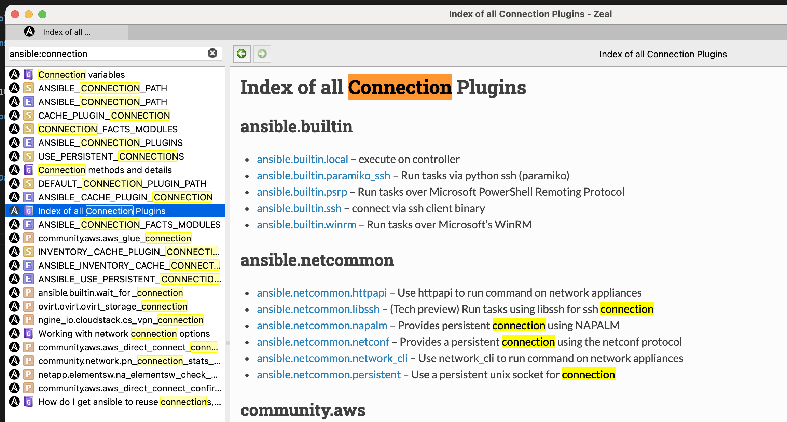

# Ansible

Passend zu meinen youtube Folge, hier das Repository mit den Playbooks.

Die Videos findet ihr unter [https://www.youtube.com/channel/UCV9lqhx9oYqmTi9AGGNWR3Q/playlists](https://www.youtube.com/channel/UCV9lqhx9oYqmTi9AGGNWR3Q/playlists)

## Ideen für weitere Folgen

### Dokumentation zu Ansiblethemen

- Zeal

### Debuggen von Playbooks

- debug modul
- logger

### Arbeiten mit json-Daten in Ansible-Playbooks

- jmespath
- jsonquery etc.

### Connection Plugins

